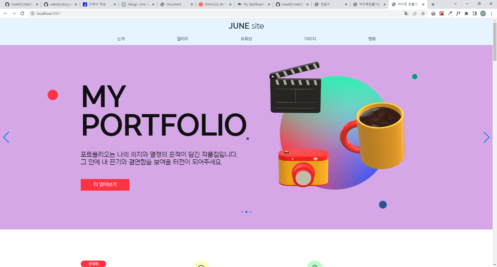

# NEXT-BLOG

NEXT.JS 13.4 버전으로 작성한 블로그 입니다.

******

사용 스택
---

HTML: 웹 페이지의 구조를 정의하는 데 사용됩니다.  
CSS : 웹 페이지와 애플리케이션의 시각적 디자인과 레이아웃을 제어하여 사용자 경험을 향상시키는 스타일링 언어입니다   
eslint :코드 품질을 향상시키고 일관성 있고 깔끔한 코드를 유지하는 데에 도움을 줍니다.
swiper : 모바일 친화적인 슬라이더와 캐러셀 컴포넌트를 쉽게 구현할 수 있습니다..
GET 방식: GET 방식은 URL 파라미터로 데이터를 전송합니다.  

*******

프로젝트 실행
---
npm run dev

